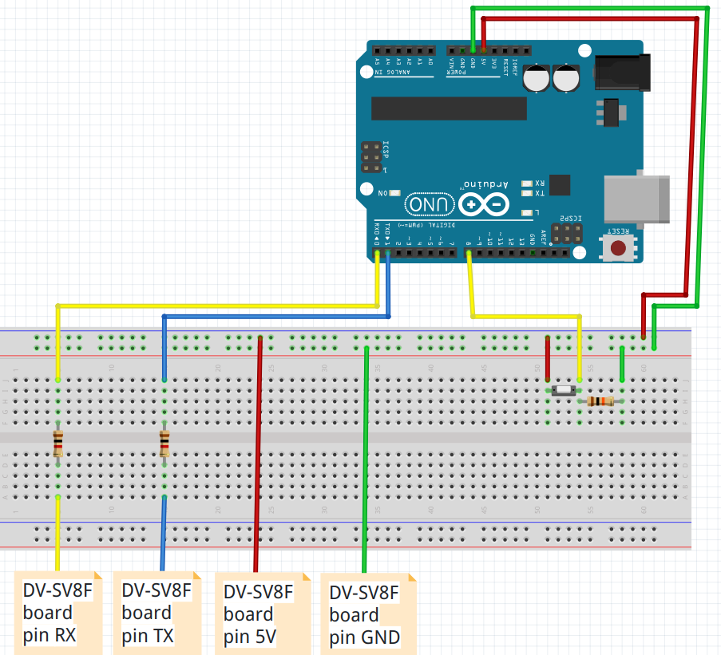
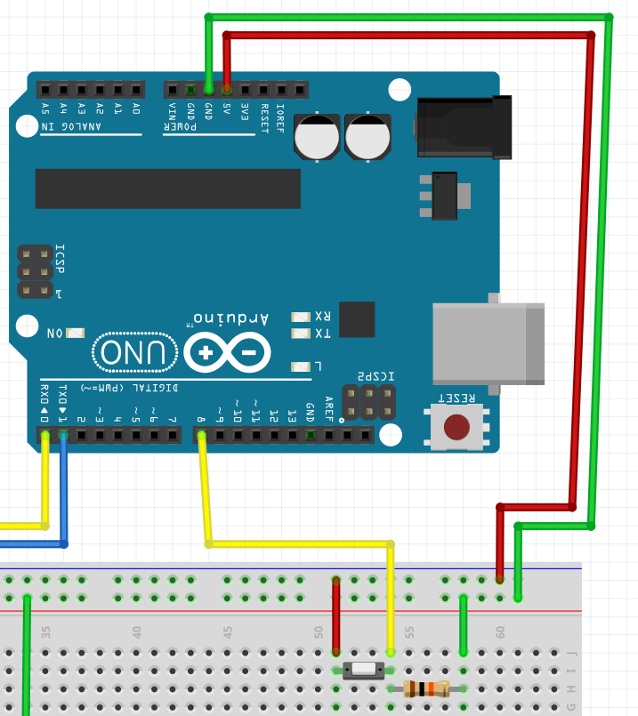
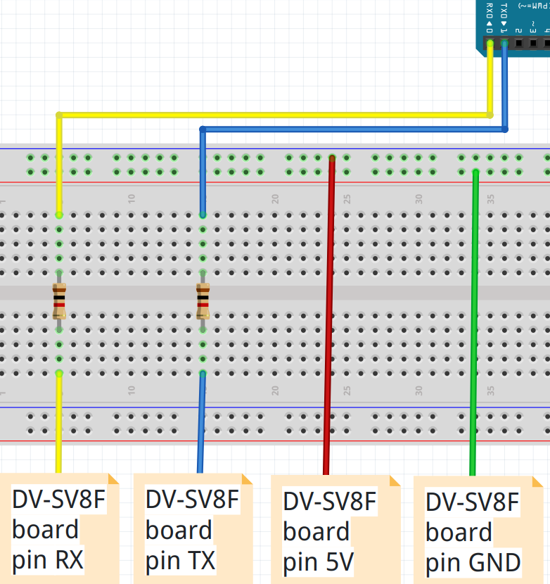
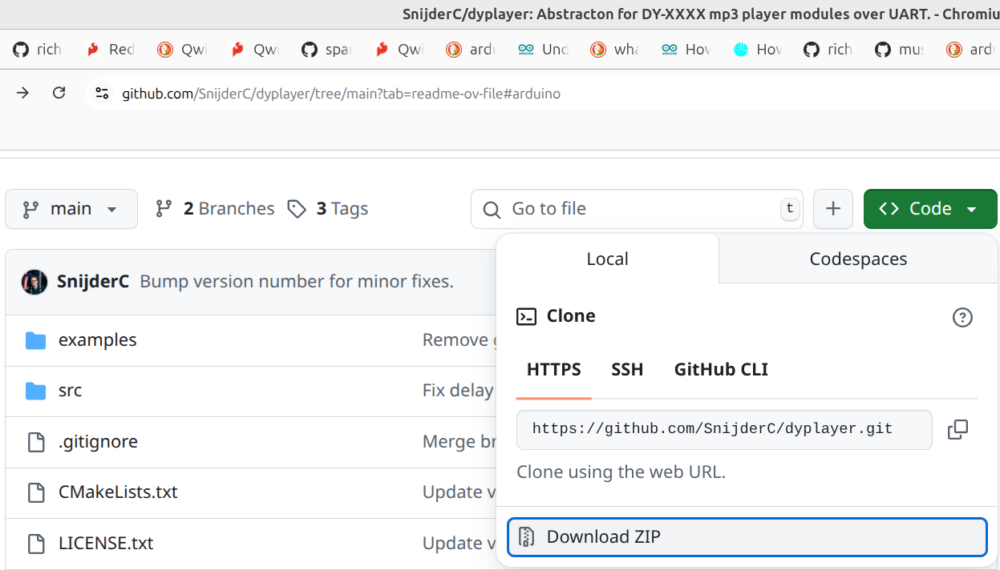
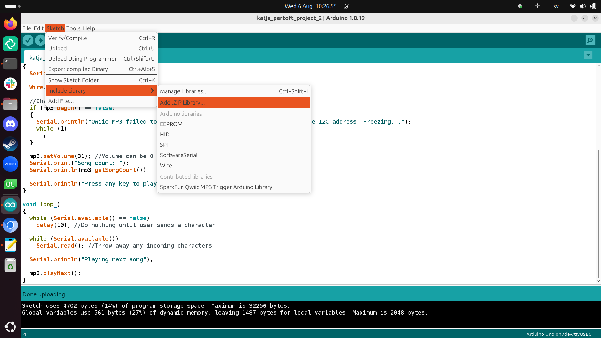
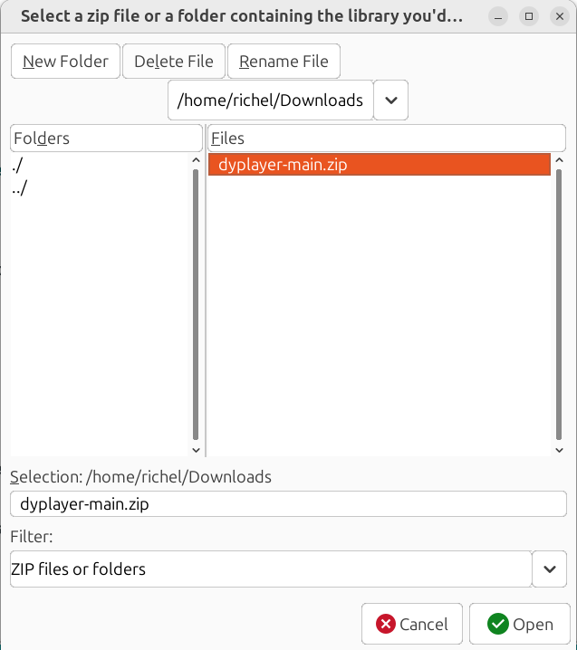
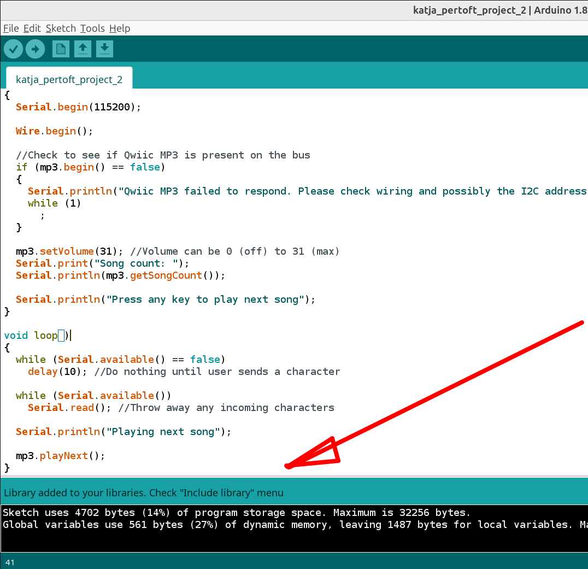
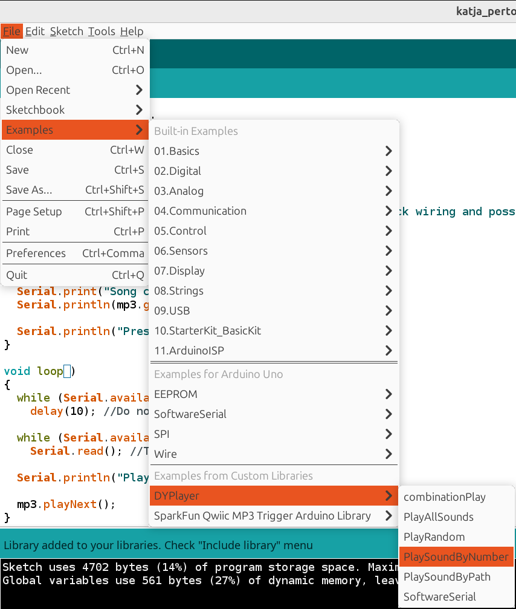

# katja_pertoft_project_2

- [Redboard](https://www.sparkfun.com/redboards)
- [DY-SV8F MP3 Voice Playback Module](https://electropeak.com/learn/interfacing-dy-sv8f-mp3-voice-playback-module-with-arduino/)

## Goal

- When pressing a button, a first song will play until the end
- For five times, when pressing a button,
  a next, different, song will play until the end

Song number|Description
-----------|------------------------
1          |bells
2          |wind
3          |talking
4          |Zen music
5          |clocks

## Uploading files

Per playback Module, upload the MP3 file you need.
It must be called `00001.MP3`.
If you want a second song, call it `00002.MP3`.
If you want a third song, call it `00003.MP3`, etc...

## Connections

From                  |To
----------------------|-------------------------
DV-SV8F board pin GND |Arduino GND
DV-SV8F board pin 5V  |Arduino 5V
DV-SV8F board pin TX  |R_TX, a 1k Ohm resistance
DV-SV8F board pin RX  |R_RX, a 1k Ohm resistance
R_TX                  |Arduino TX (pin 0)
R_RX                  |Arduino RX (pin 1)
Pushbutton side 1     |Arduino 5V
Pushbutton side 2     |Arduino pin 8
Pushbutton side 2     |a 10k Ohm resistance, side 1
Arduino GND           |a 10k Ohm resistance, side 2



> Complete schematic



> Schematic zoom on button



> Schematic zoom on DY

## Notes

### Using the Redboard with Arduino

Use a regular Arduino Uno. They are compatible.

### Setup of the DY-SV8F MP3 Voice Playback Module

About the DIP switches:

> If you have a board with DIP switches, set CON3 to on, CON1 and CON2 should remain off

```
+----------------+
| ON DIP         |
| +--+ +--+ +--+ |
| |  | |  | |XX| |
| |  | |  | |  | |
| |  | |  | |  | |
| |XX| |XX| |  | |
| +--+ +--+ +--+ |
|  1    2    3   |
+----------------+
```

### Setup of the DY-SV8F MP3 Voice Playback Module

- [GitHub](https://github.com/SnijderC/dyplayer/tree/main)



> Download a zip, from [GitHub](https://github.com/SnijderC/dyplayer/tree/main)



> In the Arduino IDE, include a library



> Select the zip file



> The library is now added



> The library has examples
